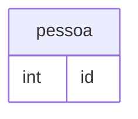

# Atividade Teórica: Regra de Negócio no BD versus na Aplicação

**Aluno(s):** Nome1, Nome2, Nome3  
**Turma:** Banco de Dados 2026  
**Data:** 16/08/2026  
**Repositório Git:** https://github.com/usuario/atividade-bd

## Resumo Executivo

As regras de negócio são importantes para garantir que um sistema funcione de acordo com as necessidades e limitações definidas por uma organização. Elas determinam, por exemplo, quais dados podem ser cadastrados, quais operações são permitidas e quais condições devem ser respeitadas durante o funcionamento do sistema.

Essas regras podem ser implementadas tanto no Banco de Dados quanto na aplicação. O Banco de Dados possui recursos como `CHECK`, `UNIQUE`, `FOREIGN KEY`, triggers, procedures e transações, que permitem garantir a integridade e a consistência dos dados. Já a aplicação pode realizar validações de entrada, aplicar regras específicas do processo e fornecer mensagens mais amigáveis ao usuário.

A posição adotada pelo grupo é que **não existe uma única abordagem ideal para todas as regras**. As regras relacionadas diretamente à integridade dos dados devem, preferencialmente, ser protegidas pelo Banco de Dados. Por outro lado, regras relacionadas à interface, experiência do usuário e comportamento específico da aplicação podem ficar na camada de aplicação.

Dessa maneira, uma abordagem híbrida tende a ser mais segura e eficiente, evitando que uma regra essencial dependa exclusivamente de uma aplicação específica.

---



# 1. Desenvolvimento Teórico

## 1.1 O que é regra de negócio?

Uma regra de negócio é uma condição, norma ou procedimento que determina como um sistema deve funcionar de acordo com as necessidades de uma organização.

Em termos simples, podemos pensar em uma regra de negócio como uma **regra que o sistema precisa obedecer**.

Por exemplo, em um sistema de vendas podemos ter as seguintes regras:

- Um produto não pode possuir preço negativo.
- O estoque não pode ficar abaixo de zero.
- Um pedido deve pertencer a um cliente existente.
- O CPF de um cliente não pode ser cadastrado duas vezes.
- Um pedido cancelado não pode ser finalizado.
- Um cliente precisa informar determinados dados antes de realizar uma compra.

As regras de negócio podem ser classificadas de diferentes maneiras.

### Regras de integridade

São regras que garantem que os dados permaneçam corretos e consistentes.

**Exemplo:**

> O preço de um produto deve ser maior que zero.

### Regras de relacionamento

Determinam como diferentes informações podem se relacionar.

**Exemplo:**

> Um pedido deve estar associado a um cliente existente.

### Regras de processo

Definem como uma operação deve acontecer.

**Exemplo:**

> Um pedido somente pode ser enviado depois que o pagamento for confirmado.

### Regras de validação

Verificam se uma informação fornecida pelo usuário possui formato ou conteúdo válido.

**Exemplo:**

> O campo de e-mail deve possuir um formato válido.

Portanto, uma regra de negócio não é necessariamente apenas uma regra do Banco de Dados. Ela representa uma necessidade do sistema e pode ser implementada em diferentes partes da arquitetura.

---

# 1.2 Regras no Banco de Dados

O Banco de Dados possui mecanismos próprios para proteger a integridade das informações. No PostgreSQL, por exemplo, existem constraints como `CHECK`, `UNIQUE`, `PRIMARY KEY` e `FOREIGN KEY`. Essas restrições fazem com que determinadas informações inválidas sejam rejeitadas diretamente pelo banco.

## CHECK

A constraint `CHECK` permite estabelecer uma condição que precisa ser verdadeira para que um registro seja inserido ou atualizado.

Por exemplo:

```sql
CREATE TABLE produtos (
    id SERIAL PRIMARY KEY,
    nome VARCHAR(100) NOT NULL,
    preco NUMERIC(10,2) CHECK (preco > 0)
);
```

Nesse exemplo, o PostgreSQL não permite cadastrar um produto com preço menor ou igual a zero.

Isso é importante porque a regra continua protegida mesmo que diferentes aplicações ou usuários tenham acesso ao mesmo Banco de Dados.

## UNIQUE

A constraint `UNIQUE` garante que determinados valores não sejam repetidos.

Por exemplo:

```sql
CREATE TABLE clientes (
    id SERIAL PRIMARY KEY,
    nome VARCHAR(100) NOT NULL,
    email VARCHAR(150) UNIQUE
);
```

Nesse caso, dois clientes não podem possuir o mesmo e-mail.

O PostgreSQL também cria automaticamente um índice B-tree associado a uma constraint `UNIQUE`, contribuindo para a eficiência da verificação de unicidade.

## FOREIGN KEY

A `FOREIGN KEY` é utilizada para garantir a integridade referencial entre tabelas.

Por exemplo:

```sql
CREATE TABLE clientes (
    id SERIAL PRIMARY KEY,
    nome VARCHAR(100) NOT NULL
);

CREATE TABLE pedidos (
    id SERIAL PRIMARY KEY,
    cliente_id INTEGER NOT NULL,
    FOREIGN KEY (cliente_id) REFERENCES clientes(id)
);
```

Nesse caso, não é possível cadastrar um pedido relacionado a um cliente que não existe.

## Triggers

Triggers são mecanismos que permitem executar determinadas ações automaticamente quando eventos específicos acontecem no Banco de Dados.

Por exemplo, uma trigger pode ser utilizada para:

- registrar alterações em uma tabela de auditoria;
- atualizar automaticamente uma informação;
- controlar determinadas operações;
- executar uma função quando um registro é inserido, alterado ou excluído.

O PostgreSQL permite utilizar funções de trigger escritas em linguagens como PL/pgSQL, PL/Perl e PL/Python.

Apesar de serem poderosas, as triggers devem ser utilizadas com cuidado. Muitas regras escondidas em triggers podem dificultar a compreensão e manutenção do sistema.

## Stored Procedures

Stored Procedures são procedimentos armazenados dentro do Banco de Dados. Elas permitem concentrar determinadas operações e regras no próprio servidor de banco.

O PostgreSQL disponibiliza o comando `CREATE PROCEDURE` para criação desses procedimentos.

Um exemplo seria criar uma procedure responsável por finalizar uma venda, realizando várias operações relacionadas de maneira controlada.

## Transações e ACID

As transações permitem agrupar várias operações como uma única unidade lógica.

Por exemplo, ao realizar uma venda, o sistema pode precisar:

1. criar o pedido;
2. inserir os produtos do pedido;
3. diminuir o estoque;
4. registrar o pagamento.

Se uma dessas operações falhar, pode ser necessário desfazer todas as alterações.

Para isso, podemos utilizar:

```sql
BEGIN;

-- criação do pedido
-- inserção dos itens
-- atualização do estoque
-- registro do pagamento

COMMIT;
```

Caso ocorra algum problema:

```sql
ROLLBACK;
```

O conceito de ACID está relacionado a quatro propriedades:

**Atomicidade:** a transação deve ser realizada completamente ou não ser realizada.

**Consistência:** os dados devem continuar obedecendo às regras de integridade.

**Isolamento:** operações concorrentes não devem gerar resultados incorretos devido à interferência entre transações.

**Durabilidade:** depois que uma transação é confirmada, suas alterações devem permanecer armazenadas.

### Vantagens das regras no Banco de Dados

- Protegem os dados independentemente da aplicação utilizada.
- Centralizam determinadas regras de integridade.
- Reduzem a possibilidade de dados inválidos.
- Garantem integridade referencial.
- Podem melhorar a segurança dos dados.
- Permitem controlar operações através de transações.
- Funcionam mesmo quando existem diferentes aplicações acessando o mesmo banco.

### Limitações

- Algumas regras podem ficar difíceis de entender quando são implementadas por meio de muitas triggers ou procedures.
- Pode haver dependência do SGBD utilizado.
- A alteração de regras pode exigir mudanças diretamente no banco.
- Regras muito complexas podem ficar mais difíceis de testar.
- Nem todas as regras de negócio pertencem ao Banco de Dados.

---

# 1.3 Regras na aplicação

A aplicação também pode implementar regras de negócio. Nesse caso, a validação ocorre antes que determinadas informações sejam enviadas ou gravadas no Banco de Dados.

Um exemplo simples seria um formulário de cadastro de cliente.

Antes de enviar os dados para o banco, a aplicação poderia verificar:

```text
se nome estiver vazio:
    mostrar "Informe o nome"

se email não possuir formato válido:
    mostrar "E-mail inválido"

se senha possuir menos de 8 caracteres:
    mostrar "A senha deve possuir pelo menos 8 caracteres"

caso contrário:
    enviar os dados para o servidor
```

Em aplicações maiores, as regras normalmente são organizadas em diferentes camadas, como:

- apresentação/interface;
- controlador;
- serviço;
- acesso a dados;
- Banco de Dados.

Uma camada de serviço pode ser responsável por concentrar regras relacionadas ao funcionamento da aplicação.

Por exemplo:

```text
realizarVenda(cliente, produtos):

    verificar se o cliente existe

    verificar se os produtos existem

    verificar se existe estoque suficiente

    calcular o valor da venda

    registrar a venda

    atualizar o estoque
```

Frameworks também fornecem recursos para validação. Dependendo da linguagem utilizada, podem existir bibliotecas específicas para validar objetos, formulários, dados recebidos por APIs e outras informações.

### Vantagens das regras na aplicação

- Permitem apresentar mensagens de erro mais amigáveis.
- Facilitam validações relacionadas à interface.
- Podem ser mais fáceis de testar com testes automatizados.
- Permitem utilizar recursos específicos da linguagem de programação.
- São adequadas para regras complexas relacionadas ao fluxo da aplicação.
- Podem evitar consultas desnecessárias ao Banco de Dados.

### Limitações

O principal problema de colocar todas as regras exclusivamente na aplicação é que **o Banco de Dados pode ser acessado por outra aplicação ou ferramenta que não possua as mesmas validações**.

Por exemplo, imagine que uma aplicação impeça preços negativos, mas um administrador execute diretamente:

```sql
INSERT INTO produtos (nome, preco)
VALUES ('Produto X', -100);
```

Se o Banco de Dados não possuir uma restrição, o valor inválido poderá ser armazenado.

Isso demonstra que algumas regras fundamentais não devem depender exclusivamente da aplicação.

---

# 1.4 Comparativo: Banco de Dados x Aplicação

| Critério | Banco de Dados | Aplicação |
|---|---|---|
| **Consistência** | Muito forte para integridade dos dados | Depende de todas as aplicações seguirem as mesmas regras |
| **Segurança** | Pode impedir diretamente dados inválidos | Pode validar e bloquear entradas antes do banco |
| **Performance** | Boa para constraints e operações próximas aos dados | Pode ser melhor para regras complexas e processamento da aplicação |
| **Manutenção** | Centraliza regras de integridade | Facilita organização de regras relacionadas ao negócio |
| **Portabilidade** | Pode depender dos recursos específicos do SGBD | Pode depender da linguagem/framework |
| **Controle central da regra** | Muito alto | Pode ser menor se houver várias aplicações |
| **Interface com usuário** | Limitada | Excelente para mensagens e feedback |
| **Regras complexas** | Podem ficar difíceis de manter | Geralmente mais flexíveis |
| **Integridade referencial** | Excelente | Não deve depender somente da aplicação |
| **Auditoria automática** | Pode ser feita com triggers | Pode ser feita pela aplicação |

Portanto, o Banco de Dados é especialmente importante para regras que protegem a integridade estrutural dos dados, enquanto a aplicação é mais adequada para regras relacionadas ao comportamento e à interação com o usuário.

---

# 1.5 Análise crítica: qual a melhor opção?

Na opinião do grupo, não é correto afirmar que todas as regras devem estar no Banco de Dados ou que todas devem estar na aplicação.

A melhor solução é utilizar **cada camada para o tipo de regra que ela consegue proteger melhor**.

As regras essenciais para a integridade dos dados devem estar no Banco de Dados.

Por exemplo:

- `preço > 0`;
- e-mail único;
- cliente existente;
- pedido relacionado a um produto existente;
- quantidade maior que zero.

Essas regras protegem diretamente os dados e devem continuar funcionando independentemente da aplicação utilizada.

Por outro lado, regras relacionadas à experiência do usuário podem ficar na aplicação.

Por exemplo:

- mostrar mensagem de erro;
- formatar CPF;
- verificar preenchimento de formulário;
- mostrar aviso de estoque baixo;
- controlar etapas de uma tela;
- calcular informações temporárias para apresentação.

Também existem regras que podem ser implementadas nas duas camadas.

Por exemplo, a aplicação pode verificar se um preço é maior que zero para mostrar uma mensagem imediatamente ao usuário, enquanto o Banco de Dados possui um `CHECK (preco > 0)` para garantir que o dado inválido nunca seja armazenado.

Essa abordagem cria uma espécie de **defesa em camadas**.

Assim, mesmo que a aplicação possua um erro, o Banco de Dados ainda protege os dados.

---

# 2. Exemplos e Casos

## 2.1 Exemplo em PostgreSQL: regra no Banco de Dados

Considerando um sistema de vendas, podemos criar as tabelas `clientes`, `produtos` e `pedidos`.

```sql
CREATE TABLE clientes (
    id SERIAL PRIMARY KEY,
    nome VARCHAR(100) NOT NULL,
    email VARCHAR(150) UNIQUE NOT NULL
);

CREATE TABLE produtos (
    id SERIAL PRIMARY KEY,
    nome VARCHAR(100) NOT NULL,
    preco NUMERIC(10,2) NOT NULL CHECK (preco > 0),
    estoque INTEGER NOT NULL CHECK (estoque >= 0)
);

CREATE TABLE pedidos (
    id SERIAL PRIMARY KEY,
    cliente_id INTEGER NOT NULL,
    quantidade INTEGER NOT NULL CHECK (quantidade > 0),
    produto_id INTEGER NOT NULL,

    FOREIGN KEY (cliente_id)
        REFERENCES clientes(id),

    FOREIGN KEY (produto_id)
        REFERENCES produtos(id)
);
```

Nesse exemplo existem várias regras protegidas pelo próprio Banco de Dados:

- O cliente precisa possuir um identificador.
- O nome do cliente não pode ser nulo.
- O e-mail deve ser único.
- O preço do produto deve ser maior que zero.
- O estoque não pode ser negativo.
- A quantidade do pedido deve ser maior que zero.
- O pedido precisa estar associado a um cliente existente.
- O pedido precisa estar associado a um produto existente.

Essas restrições são importantes porque impedem que dados inválidos sejam armazenados mesmo que a inserção seja feita diretamente no Banco de Dados.

---

## 2.2 Exemplo de validação na aplicação

Imagine que a aplicação receba uma solicitação para criar um produto.

Um pseudocódigo poderia ser:

```text
função cadastrarProduto(nome, preco, estoque):

    se nome estiver vazio:
        retornar "O nome é obrigatório"

    se preco <= 0:
        retornar "O preço deve ser maior que zero"

    se estoque < 0:
        retornar "O estoque não pode ser negativo"

    produto = criar produto

    salvar produto no Banco de Dados

    retornar "Produto cadastrado com sucesso"
```

A aplicação realiza a validação antes de enviar os dados para o Banco de Dados.

Isso melhora a experiência do usuário, pois é possível informar imediatamente qual campo está incorreto.

Entretanto, mesmo existindo essa validação, ainda é interessante manter as regras essenciais no Banco de Dados:

```sql
preco NUMERIC CHECK (preco > 0)
estoque INTEGER CHECK (estoque >= 0)
```

Dessa forma, existe uma proteção tanto na aplicação quanto no Banco de Dados.

---

## 2.3 Caso real: sistema de vendas

Um sistema de vendas é um bom exemplo para demonstrar a utilização das duas abordagens.

Imagine uma loja que possui:

- clientes;
- produtos;
- pedidos;
- itens de pedido;
- pagamentos;
- estoque.

### Regras que devem estar no Banco de Dados

Algumas regras importantes seriam:

1. O preço do produto não pode ser negativo.
2. O estoque não pode ser negativo.
3. Um e-mail não pode ser duplicado.
4. Um pedido deve possuir um cliente existente.
5. Um item do pedido deve possuir um produto existente.
6. A quantidade de um produto no pedido deve ser maior que zero.

Essas regras estão diretamente relacionadas à integridade dos dados.

### Regras que podem ficar na aplicação

A aplicação poderia controlar:

1. Mensagens de erro.
2. Formatação dos campos.
3. Validação de formulários.
4. Fluxo das telas.
5. Exibição de produtos disponíveis.
6. Confirmações antes de cancelar uma compra.
7. Avisos para o usuário.

### Regra que pode envolver os dois lados

Considere a seguinte regra:

> Um produto não pode ser vendido quando o estoque é insuficiente.

A aplicação pode verificar o estoque antes de permitir a venda, mas essa verificação não deve ser feita de maneira ingênua, pois duas vendas podem acontecer simultaneamente.

Por isso, operações de venda e atualização de estoque devem ser cuidadosamente controladas por transações e mecanismos de concorrência do Banco de Dados.

O PostgreSQL oferece diferentes níveis de isolamento de transações, incluindo `Read Committed`, `Repeatable Read` e `Serializable`, sendo `Serializable` o nível mais rigoroso.

Um exemplo simplificado seria:

```sql
BEGIN;

-- verificar/atualizar estoque
-- registrar pedido
-- registrar itens

COMMIT;
```

Caso alguma operação falhe:

```sql
ROLLBACK;
```

Assim, as alterações relacionadas podem ser tratadas como uma única operação lógica.

---

# 3. Referências

- POSTGRESQL GLOBAL DEVELOPMENT GROUP. **PostgreSQL Documentation: Constraints**. Documentação oficial do PostgreSQL. Disponível em: https://www.postgresql.org/docs/current/ddl-constraints.html. Acesso em: 16 ago. 2026.

- POSTGRESQL GLOBAL DEVELOPMENT GROUP. **PostgreSQL Documentation: Triggers**. Documentação oficial do PostgreSQL. Disponível em: https://www.postgresql.org/docs/current/triggers.html. Acesso em: 16 ago. 2026.

- POSTGRESQL GLOBAL DEVELOPMENT GROUP. **PostgreSQL Documentation: Transaction Isolation**. Documentação oficial do PostgreSQL. Disponível em: https://www.postgresql.org/docs/current/transaction-iso.html. Acesso em: 16 ago. 2026.

- POSTGRESQL GLOBAL DEVELOPMENT GROUP. **PostgreSQL Documentation: CREATE PROCEDURE**. Disponível em: https://www.postgresql.org/docs/18/sql-createprocedure.html. Acesso em: 16 ago. 2026.
---

# 4. Conclusões

A realização desta atividade permitiu compreender que as regras de negócio podem ser implementadas em diferentes partes de um sistema e que a escolha do local correto depende do tipo de regra.

O Banco de Dados possui recursos importantes para proteger a integridade das informações, como `CHECK`, `UNIQUE`, `PRIMARY KEY`, `FOREIGN KEY`, triggers, procedures e transações. Esses recursos são especialmente importantes porque garantem que os dados permaneçam consistentes mesmo quando são acessados por diferentes aplicações.

Por outro lado, a aplicação possui vantagens na implementação de regras relacionadas à interação com o usuário, validação de formulários, mensagens de erro e controle dos processos do sistema. A aplicação também permite utilizar recursos específicos das linguagens de programação e frameworks.

O principal aprendizado do grupo é que **não devemos escolher entre Banco de Dados ou aplicação de maneira absoluta**. Uma arquitetura bem projetada pode utilizar os dois.

As regras fundamentais de integridade devem ser protegidas no Banco de Dados, enquanto regras relacionadas ao comportamento da aplicação podem ser implementadas na camada de serviço ou em outras partes da aplicação.

Dessa forma, a combinação das duas abordagens oferece maior segurança, consistência e organização. A aplicação proporciona uma melhor experiência para o usuário, enquanto o Banco de Dados funciona como uma última camada de proteção para garantir que informações inválidas não sejam armazenadas.

Portanto, a conclusão do grupo é que **a abordagem híbrida é a mais adequada para a maioria dos sistemas**, pois aproveita as vantagens das duas alternativas e reduz os riscos de inconsistência dos dados.

---

# Link do Repositório Git

**Repositório:** https://github.com/usuario/atividade-bd

> **Observação:** substitua `usuario/atividade-bd` pelo endereço real do repositório do grupo antes da entrega.
